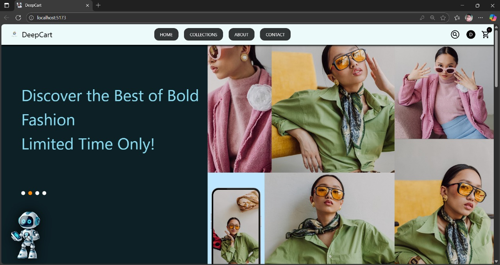
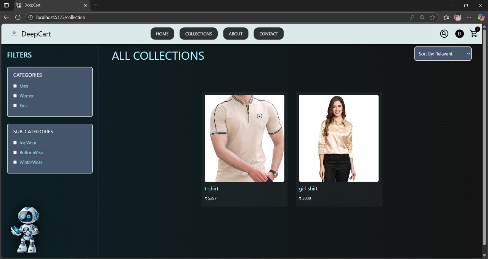
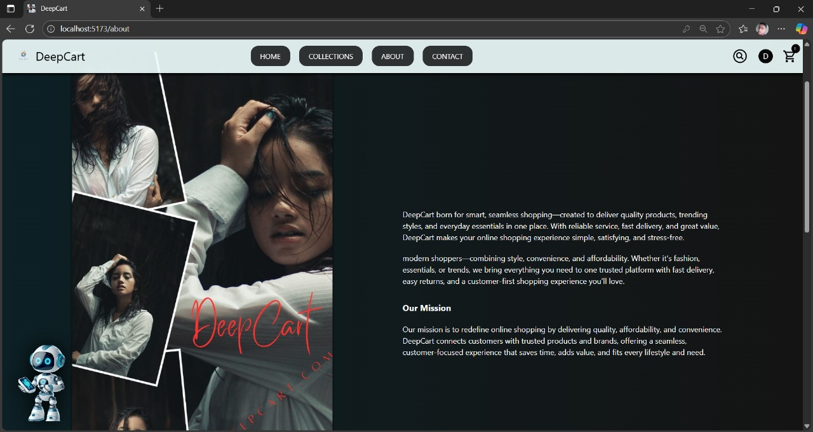
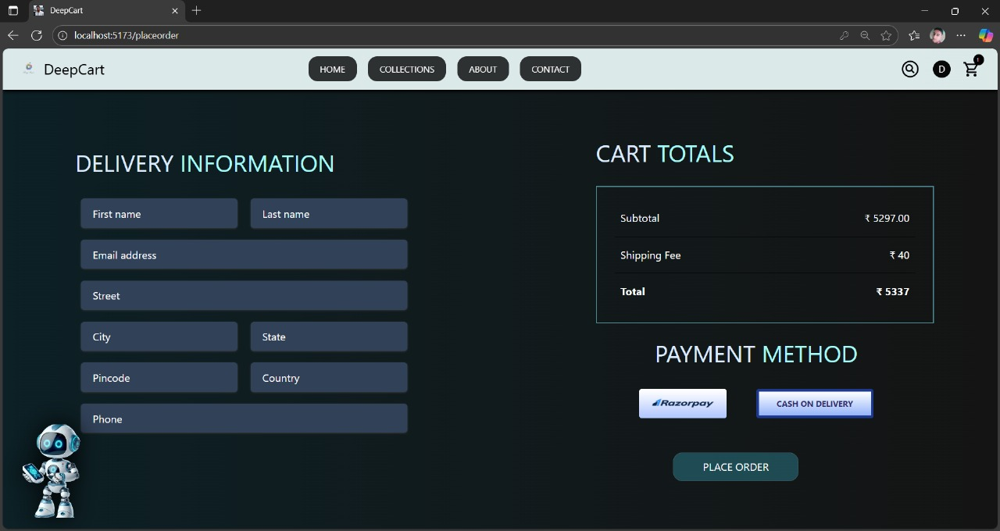
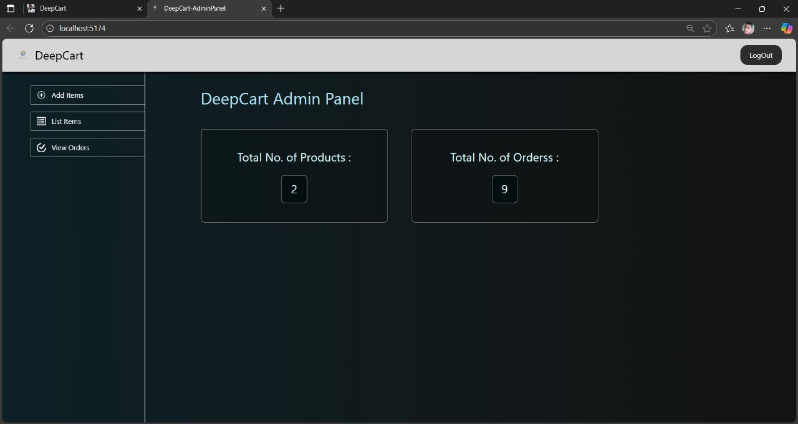

# 🛒 DeepCart – E-Commerce Website

DeepCart is a modern e-commerce web application built with a clean UI and smooth user experience.  
It allows users to browse collections, view product details, add items to cart, and checkout seamlessly.

---

## 🚀 Features
- 🏠 Home Page with offers and promotions  
- 📂 Collections Page showcasing products  
- 🛍 Add to Cart & Checkout functionality  
- 🔐 User Authentication (Login / Signup)  
- 💳 Payment Gateway Integration (Stripe / Razorpay)  
- 📱 Responsive Design (Mobile + Desktop)  
- 🎨 Smooth animations with modern UI  

---

## 🛠 Tech Stack
*Frontend:*
- React.js  
- Tailwind CSS  
- Framer Motion (Animations)  
- ShadCN / Material UI (UI Components)  

*Backend:*
- Node.js + Express.js  

*Database:*
- MongoDB (NoSQL) or MySQL (SQL)  

*Other Tools:*
- Git & GitHub (Version Control)  
- Postman (API Testing)  
- Cloudinary / Firebase (Image Hosting)  
- Razorpay / Stripe (Payment Gateway)  

---

## 📷 Screenshots

### Home Page  


### Collections Page  


### Cart Page  


### about Page  


### Collections Page  


### payment Page  


### admin Page  


---

## ⚙ Installation & Setup
1. Clone the repository:
   ```bash
   git clone https://github.com/your-username/deepcart.git
   cd deepcart

2. Install dependencies:

npm install


3. Run the development server:

npm run dev 

4. Open in browser:

http://localhost:5174


---

📜 License

This project is licensed under the MIT License.


---

👨‍💻 Author

Deepak Singh

🎓 BCA Student, Galgotias University

💼 Aspiring Web Developer | AI Enthusiast

🔗 LinkedIn | GitHub


---

